<div align="center">

# Saakshi · साक्षी

### Proof, not just photos.

**Saakshi ("witness") turns field photos from NGOs and community groups into verified, measured, traceable proof of impact.**
Every number in a report links to the photo behind it.

Code Cubicle 6.0 · PS02 · Cloudinary track

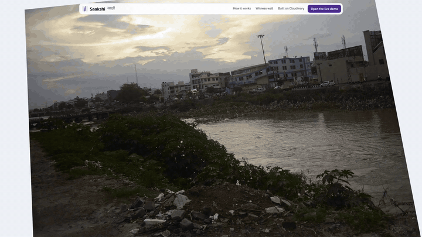

**[▶ Launch film (88 s)](docs/media/saakshi-launch-preview.mp4)** · **[▶ 3-minute walkthrough](docs/media/saakshi-demo-3min-preview.mp4)** · [What's real in the videos](video/preview/DESCRIPTION.md)

</div>

---

## The problem

Anyone can post a clean-up photo. A funder, a CSR team or a city partner has no way to tell whether it was taken at the site, on the day, or whether it's a stock photo, a reused photo from last year's drive, or a photo from another city with a location stamp drawn on. Reports are a folder of photos and a number someone typed.

## What Saakshi does

| | |
|---|---|
| 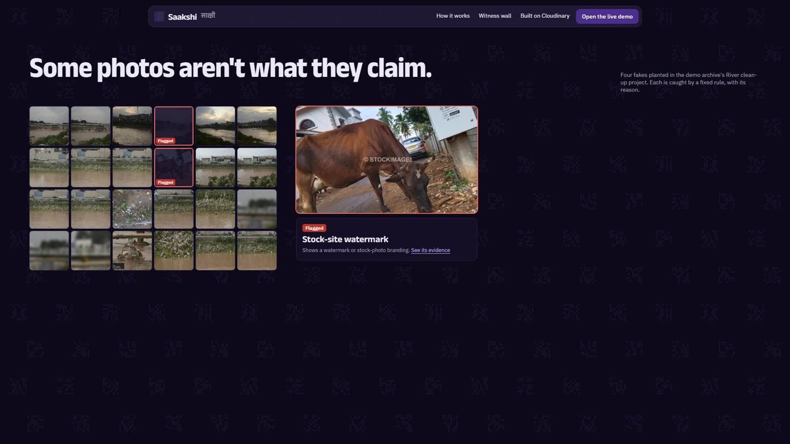 | **It catches what isn't real.** Every photo is read for where and when it was taken, fingerprinted (pHash) and checked by a **rule-based Trust Engine**: fixed, published rules with a reason for every point. A reused photo, a stock watermark, a photo taken 715 km from the site and a drawn-on location stamp are each flagged with their reason. |
| 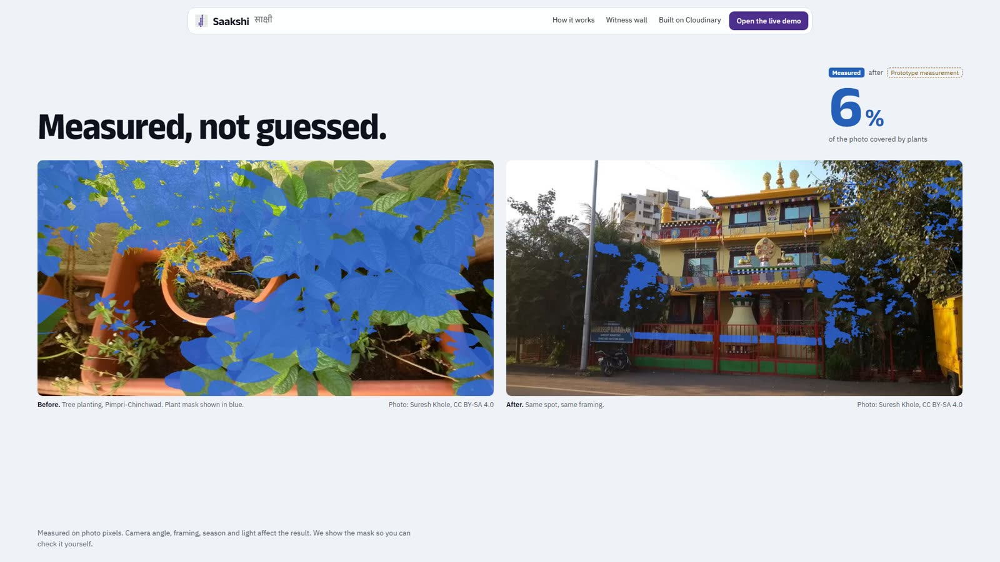 | **It measures change, it doesn't guess it.** Before/after pairs follow fixed rules (same spot, in time order, a minimum gap). Both photos are segmented into a litter (or green-cover) mask on the same frame, and cover is a count of mask pixels. |
| 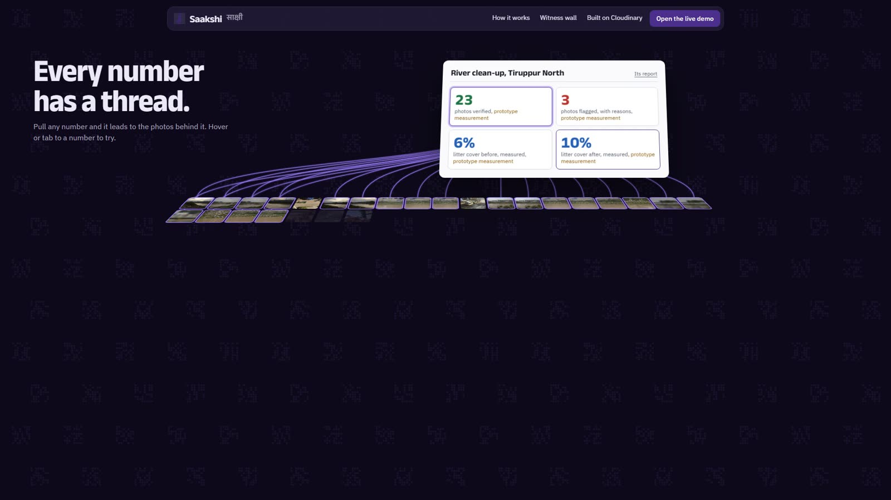 | **Every number has a thread.** Report numbers are database aggregates, never model output. Hover or tap one and threads run to the photos it counted; each photo opens its evidence page with its ledger and a hash-chained history. |
| 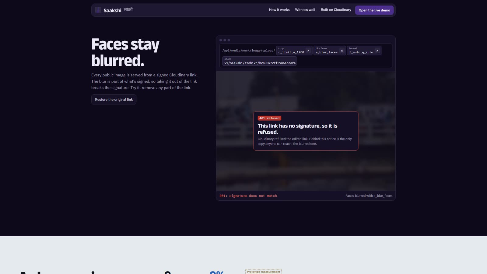 | **Faces stay blurred, even if you edit the link.** Public images are signed, face-blurred Cloudinary transformations. Remove the blur or the signature from the URL and the CDN refuses it (401). |
| 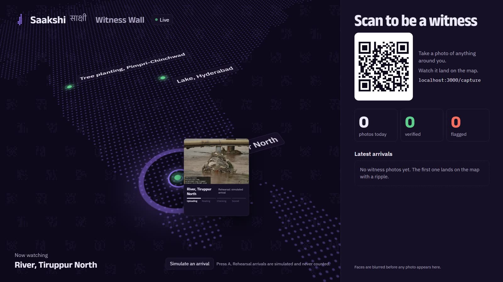 | **Anyone can be a witness.** A QR poster at each spot opens the capture page: live GPS ring, the spot's radius, shutter, and the photo is checked and scored in seconds. Check-ins land on the Witness Wall and on the spot's trend. |
| 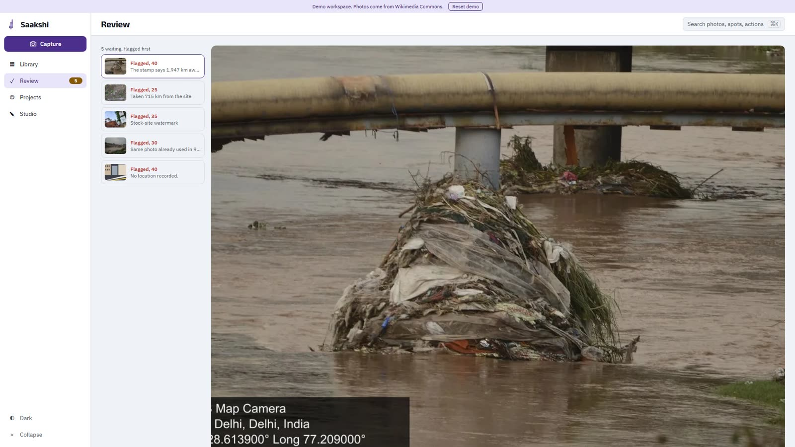 | **People decide what rules flag.** Flagged photos go to a review queue with the closest near-duplicate side by side. Every decision needs a note and joins the audit chain. |

<details>
<summary><b>More screens</b>: library, evidence drawer, public report, evidence page, phone capture</summary>

| Library: map, grid, search chips | Evidence drawer, taken apart |
|---|---|
| 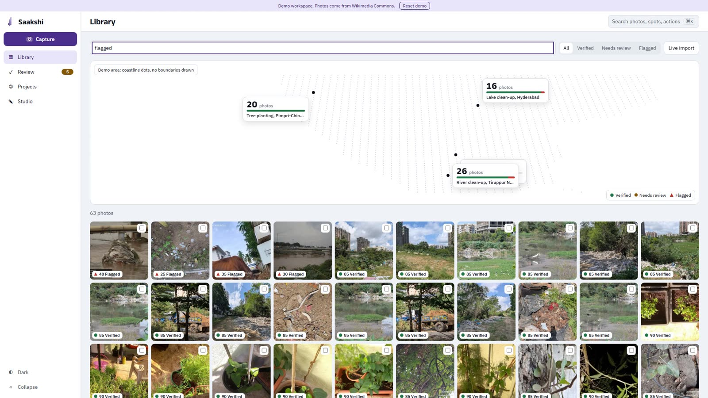 | 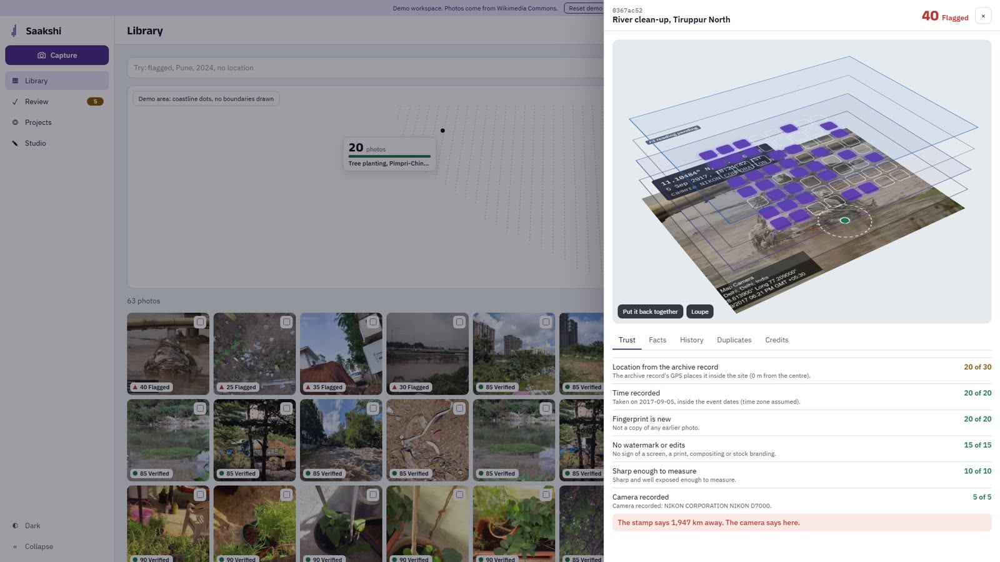 |
| **Public report** | **Evidence page** |
| 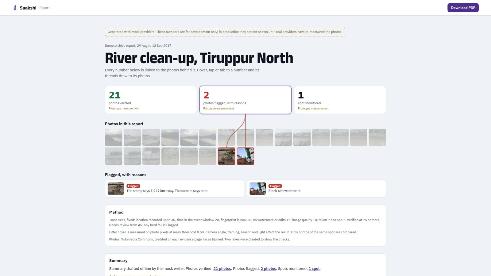 | 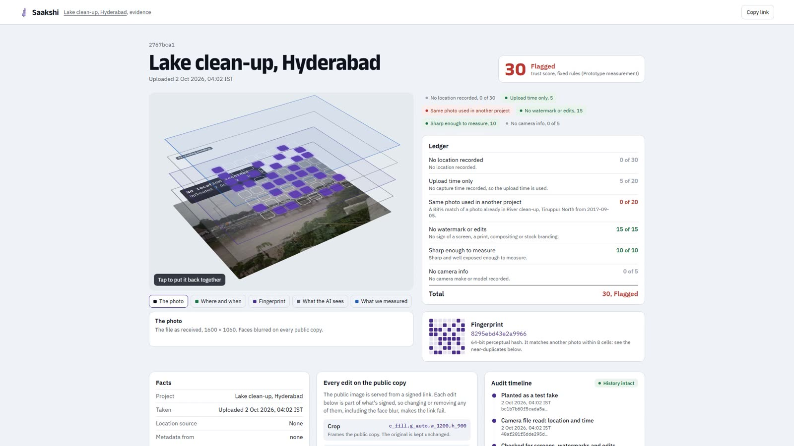 |

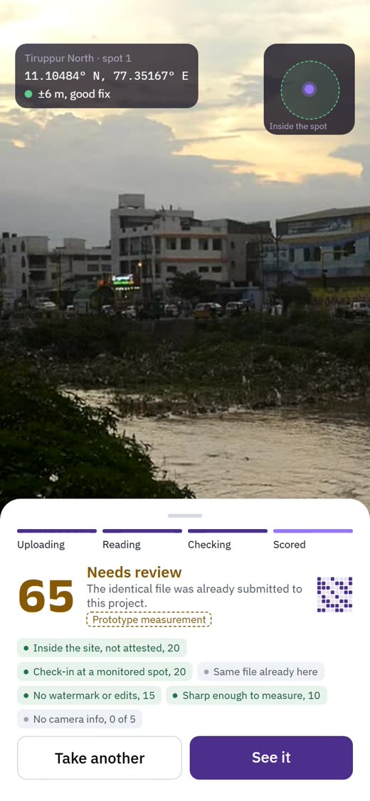

</details>

## How it works

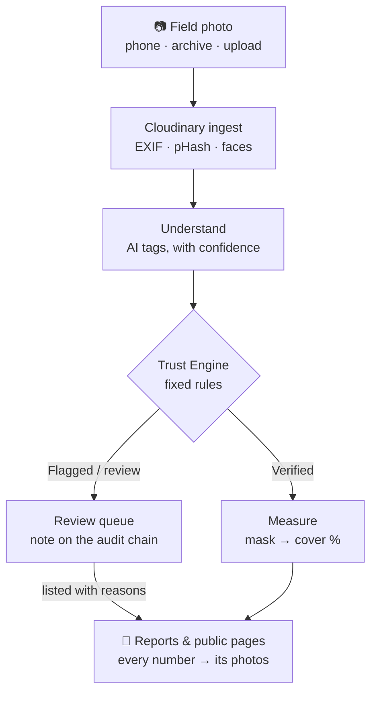

The pipeline runs as idempotent steps keyed by asset id (parse metadata → analyze → understand → embed → assign → score → measure → finalize), each writing one audit row. Four rules hold everywhere:

1. **Totals and KPIs are database aggregates**, never LLM output.
2. **The LLM never writes digits.** Prose references numbers only as `{{claim:id}}`, and every generated text is validated.
3. **Trust scores come only from the rules** in `src/lib/trust` (pure, tested); the model may only rephrase reasons.
4. **Public images are always signed and face-blurred**; originals never reach the browser.

### Built on Cloudinary

| Job | What Saakshi uses |
|---|---|
| Intake forensics | Upload to `authenticated` storage with `media_metadata`, `faces`, `quality_analysis`; the fingerprint is Saakshi's own pHash of the stored image |
| Perception | Analyze API: AI vision tagging, moderation, watermark detection (each value AI-estimated, with a confidence) |
| Measurement | `e_extract` segmentation masks at a fixed threshold; cover counted from mask pixels |
| Privacy | `e_blur_faces` on every public copy, delivered as signed URLs (Strict Transformations) |
| Provenance | Versioned public ids and signatures, so a report always opens the exact file it counted |

Every request, its documentation and its verification status: [docs/external-apis.md](docs/external-apis.md).

## Quick start

No accounts or keys needed: every external service (media, analysis, AI, database, queue, geocoder) has a deterministic local mock, and a provider turns real only when all of its variables are set.

```bash
pnpm i
pnpm db:migrate    # PGlite (Postgres in WASM, with pgvector) in ./.data/pglite
pnpm demo:reset    # 58 Wikimedia Commons photos → 3 auto-built projects + 4 planted fakes (offline, from the cache)
pnpm dev           # http://localhost:3000
```

| Page | What it is |
|---|---|
| `/` | The story: one photo taken apart, chaos to order, the catch, measured, threads, faces stay blurred, try to fool it, be a witness |
| `/demo` | Pick a role: volunteer, manager, funder |
| `/library` · `/review` · `/projects/<slug>` · `/studio` | The app: map and grid with search chips, the review queue, project overview, report and campaign studio |
| `/capture?spot=<slug>` | Witness Capture on a phone (camera + GPS need HTTPS: `pnpm tunnel`) |
| `/witness` | The Witness Wall for a venue screen |
| `/e/<assetId>` · `/r/<reportId>` · `/spots/<slug>` · `/spots/<slug>/poster` | Public evidence page, report, spot page, A4 QR poster |
| `/how-it-works` | The trust simulator and the pipeline, as we really call it |

PGlite allows one process at a time: run `demo:*` scripts with `pnpm dev` stopped, or use **Run demo import** on `/dev/status`.

## The demo data

The demo archive is built from Wikimedia Commons by fixed rules (`data/demo-dataset.config.ts`, [docs/demo-data.md](docs/demo-data.md)). Every photo keeps its author, licence and source link.

| Project | Type | Photos |
|---|---|---|
| River clean-up, Tiruppur North | clean-up | 23 + 3 planted |
| Tree planting, Pimpri-Chinchwad | plantation | 20 |
| Lake clean-up, Hyderabad | water | 15 + 1 planted |

In production (real Cloudinary and OpenAI), each planted input is Flagged for its own reason: reused (30), stock watermark (35), location mismatch (25), stamp mismatch (40). Of the 58 archive photos, 46 are Verified and 11 Need review because Cloudinary's watermark detector saw a watermark that the vision check didn't (a person decides). One is Flagged: it carries the photographer's burned-in signature, which both checks see. Three hero photos are shown as "not measurable": Cloudinary refused the litter extraction, so they get no number. Offline, with the mock providers, all 58 archive photos are Verified.

## Evidence that it works

| Check | Result |
|---|---|
| Tests (`pnpm test`, offline, all providers mocked) | **549 passing** in 57 files |
| Design parity (`design/PARITY.md`): each page against the design export, frame by frame | **144 runs, 142 within 1.5%**; both others explained (a random scatter in the prototype) |
| Design inventory (`design/INVENTORY.md`) | **1,859 items**: 744 verified, 1,115 verified with a note; all 28 ship-checklist items done |
| Quality gates (`docs/quality-gates.md`) | **171 of 187 checks**: Lighthouse desktop 85–100 performance and 98–100 accessibility, axe clean, five browsers, reduced-motion and low-power modes, 136 fps scrolling the landing |
| Open | Mobile LCP under Lighthouse's simulated slow 4G; the review page's 1280 px photo on a throttled network (both recorded in the gates) |

The engineering journal (decisions, issues, evidence for every number above): [docs/ENGINEERING.md](docs/ENGINEERING.md). The developer guide (rules, folders, the provider pattern, gotchas): [docs/DEVELOPMENT.md](docs/DEVELOPMENT.md).

## What's real and what's a prototype

The app runs on mock providers until the live services are connected ([docs/MANUAL_STEPS.md](docs/MANUAL_STEPS.md)). Mock-derived numbers are tagged in development and **never shown in production** (`src/lib/provenance.ts`). The preview build behind the videos (`DEMO_PREVIEW=1`) shows values computed on this machine badged "Prototype measurement", and withholds anything a mock AI made up ("AI reading pending"). Photos, locations, fingerprints and rules are real; AI checks and litter masks are prototypes until the live pipeline is connected.

## Commands

| Command | What it does |
| --- | --- |
| `pnpm dev` · `pnpm build` · `pnpm start` | Dev server · production build · production server |
| `pnpm test` · `pnpm lint` · `pnpm typecheck` | Tests (offline) · ESLint · TypeScript |
| `pnpm demo:reset` · `demo:import` · `demo:plant` | Rebuild the demo offline · import · plant the 4 test inputs |
| `pnpm measure:pairs [slug]` · `demo:remeasure` | Re-pair by the rules (every rejected candidate and why) · measure again with the configured providers |
| `pnpm services:check` · `verify:env --prod` · `cld:setup` | Live checks with keys · what a deployment is missing · Cloudinary metadata fields and signed preset |
| `pnpm quality` | The quality gates against a running build → docs/quality-gates.md |
| `pnpm parity:capture` · `parity:report` · `parity:summary` · `design:verify` | Design parity and the inventory's evidence |
| `pnpm video:final` | Re-record the footage and re-render both preview videos from the data as it is now |
| `pnpm tunnel` | HTTPS quick tunnel for phone testing (`cloudflared`) |

## Stack

Next.js 16 (App Router, React 19) · TypeScript · Tailwind v4 · GSAP + Lenis · three.js (landing only) · Drizzle ORM · PGlite + pgvector locally, Postgres in production · Inngest · Zod · Vitest · Playwright · sharp · react-pdf · Cloudinary · OpenAI.

## Credits

Photos: Wikimedia Commons contributors, credited on every page that shows them and in [video/preview/DESCRIPTION.md](video/preview/DESCRIPTION.md). Fonts: Anek Latin and Anek Devanagari (The Anek Project Authors), IBM Plex (IBM), SIL Open Font License 1.1. Saakshi is an independent project, not affiliated with the Swachhata Hi Seva campaign.
